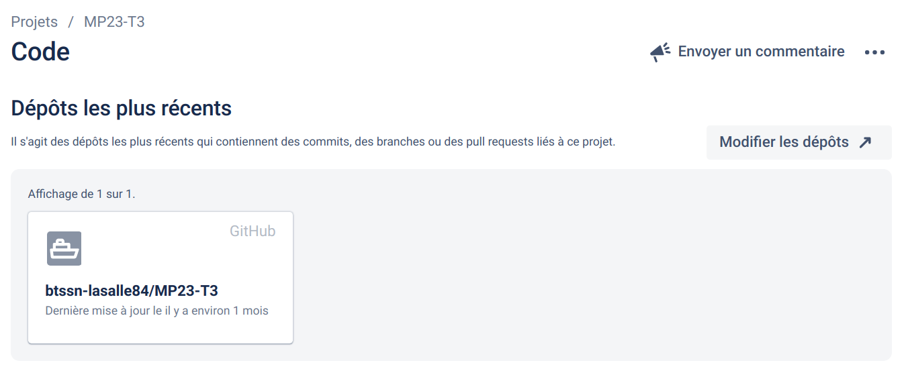

[](https://github.com/btssn-lasalle84/MP23-T3/actions/workflows/c-cpp.yml) [](https://github.com/btssn-lasalle84/MP23-T3/actions/workflows/cppformat.yml)

# Mini-Projet : CUL DE CHOUETTE

---

<p align="center">


## Présentation

Le **[Cul de chouette](https://fr.wikibooks.org/wiki/Bo%C3%AEte_%C3%A0_jeux/Le_cul_de_chouette)** est un jeu originaire de la série [Kaamelott](https://fr.wikipedia.org/wiki/Kaamelott) et se joue avec trois dés à 6 faces. Le but du jeu est d'atteindre ou dépasser 343 points, le score à atteindre provenant des initiales du nom du jeu (CDC), soit les 3e, 4e et 3e lettres de l'alphabet.

Les points sont obtenus en utilisant des combinaisons grâce aux résultats des dés, par exemple : la Velute, la Chouette, la Suite, etc....

---

> Ceci est un mini-projet de 2 étudiants de BTS SN option Informatique & Réseaux développé en C++. L'objectif était la mise en oeuvre d'une méthode agile [Kanban](https://fr.wikipedia.org/wiki/Kanban_(d%C3%A9veloppement)) avec les outils **Jira / Github** et en appliquant le _workflow_ [Gitflow](https://btssn-lasalle84.github.io/guides-developpement-logiciel/jira.html#ancre-gitflow). L'application devait être limitée à une interface en ligne de commande (console).

---

## Exemple

```bas
$ make
g++ -std=c++11 -Wall -I. -c culDeChouette.cpp
g++ -std=c++11 -Wall -I. -c De.cpp
g++ -std=c++11 -Wall -I. -c Partie.cpp
g++ -std=c++11 -Wall -I. -c Joueur.cpp
g++ -std=c++11 -Wall -I. -c Ihm.cpp
g++ -o culDeChouette.out culDeChouette.o De.o Partie.o Joueur.o Ihm.o

$ ./culDeChouette.out
-----Bienvenue sur le jeu du Cul De Chouette ! Version 2-----

 Pouvons nous commencer ?

Si vous êtes prêt à jouer, Entrez (1)
Si vous souhaitez quitter, Entrez (2)
Si vous souhaitez voir les règles, Entrez (3)
Si vous voulez voir les difficulté, Entrez (4)

...
```

## Jira

Intégration avec Github :



### Les versions


### Feuille de route


### Tickets

#### Version 1.0


#### Version 1.1


#### Version 2.0


## Recette

| Fonctionnalitées                     | oui | non |
| ------------------------------------ | :---: | :---: |
| Jouer une partie                     | X   | |
| Saisir le nom d'un joueur            | X   | |
| Afficher le déroulement d'une partie | X   | |
| Jouer plusieurs parties              | X   | |
| Choisir un niveau de difficulté      | X   | |
| Jouer contre un ordinateur           | X   | |

## Auteurs

- Matthieu Salaun <<matthieu.salaun30@gmail.com>>
- Célian Subirana <<celian.subirana.pro@gmail.com>>

---
©️ BTS SNIR LaSalle Avignon 2023
